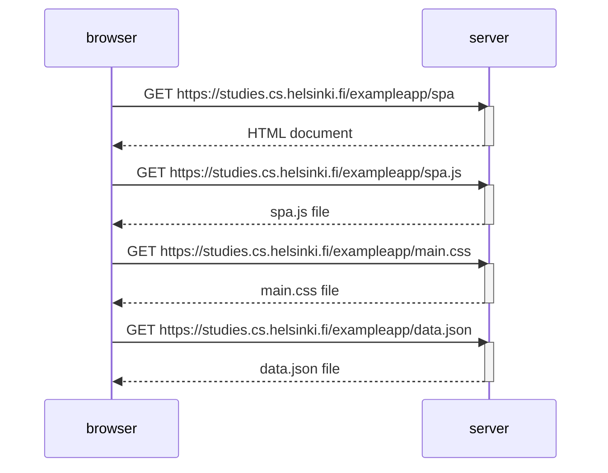

# Exercise 0.5
This is a digram depicting the situation where the user goes to the single-page 
app https://studies.cs.helsinki.fi/exampleapp/spa version of the notes app from exercise 0.4.

This diagram is created using the Mermaid syntax of GitHub's Markdown pages.

